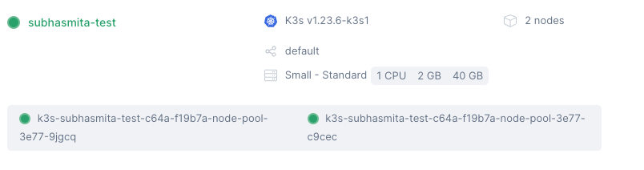

Effective cluster monitoring is still a recurring problem in Kubernetes orchestration. This blog post examines one such solution: leveraging Fission, a Kubernetes-native Function-as-a-Service (FaaS) framework, to provide serverless architecture for Kubernetes cluster monitoring.

## Serverless: The Lazy Developer's Dream

Serverless computing represents a cloud execution model where the cloud provider dynamically manages the allocation and provisioning of servers. Key benefits include:

- Scalability: Serverless functions can automatically scale based on the size and activity of your cluster.
- Cost-Efficiency: Pay only for the compute resources used during monitoring activities.
- Reduced Operational Overhead: Minimize the need for managing additional monitoring infrastructure.

In order to establish a reliable cluster monitoring solution, we'll walk through the process of setting up Fission, a serverless framework inherent to Kubernetes, and integrating it with Prometheus and Grafana throughout this post. Everything from cluster setup to the deployment of unique monitoring features and dashboard configuration will be covered.


## Why Fission?

Fission is an open-source, Kubernetes-native serverless framework that enables developers to create, deploy, and manage functions with minimal infrastructure concerns. Key features include:

- Support for multiple languages (Go, Python, Node.js, etc.)
- Cold start optimization
- Automatic API routing
- Kubernetes event triggers

These features make Fission an ideal choice for implementing serverless monitoring solutions in Kubernetes environments.

## Implementation: Step-by-Step Guide

### 1. Cluster Setup

We'll use Civo Cloud for this demonstration, though the principles apply to any Kubernetes environment. For detailed documentation refer to the [website](https://www.civo.com/docs/kubernetes/create-a-cluster). 

```shell
civo k3s create <cluster-name> --size=g4s.kube.small --nodes=2
```


For local testing, Minikube is a viable alternative:

```shell
minikube start --driver=docker
```

### 2. Fission Installation

Install Fission using Helm:

```bash
helm repo add fission-charts https://fission.github.io/fission-charts/
helm repo update
helm install fission fission-charts/fission-all --namespace fission --create-namespace
```
    
Verify the installation: You can verify the installation by checking the status of the Fission components:
    
```bash
kubectl get pods --namespace fission
```
    
Start the Fission UI: Finally, you can start the Fission UI to manage your functions and triggers.
    
```bash
./fission ui start
```
    

### 3. Monitoring Stack: Prometheus and Grafana

Additionally, Fission enables watch-based triggers for Kubernetes. For instance, you might configure a function to look for all pods in a specific namespace that match a specific label. The function receives the context of the watch event type (added/removed/updated) as well as the serialised object. Simple monitoring might be done with the help of these event handler routines.

For our use case, we'll go ahead with deploying Prometheus and Grafana using the kube-prometheus-stack:

```bash
helm repo add prometheus-community https://prometheus-community.github.io/helm-charts
helm repo update
helm install prometheus prometheus-community/kube-prometheus-stack --namespace monitoring --create-namespace
```

### 4. Custom Monitoring Function

Develop a Fission function to collect cluster metrics:

```go
package main

import (
    "fmt"
    "log"
    "net/http"

    metav1 "k8s.io/apimachinery/pkg/apis/meta/v1"
    "k8s.io/client-go/kubernetes"
    "k8s.io/client-go/rest"
)

func Handler(w http.ResponseWriter, r *http.Request) {
    config, err := rest.InClusterConfig()
    if err != nil {
        log.Fatalf("Error getting cluster config: %v", err)
    }

    clientset, err := kubernetes.NewForConfig(config)
    if err != nil {
        log.Fatalf("Error creating clientset: %v", err)
    }

    pods, err := clientset.CoreV1().Pods("").List(r.Context(), metav1.ListOptions{})
    if err != nil {
        log.Fatalf("Error listing pods: %v", err)
    }

    fmt.Fprintf(w, "Cluster Status:\n")
    for _, pod := range pods.Items {
        fmt.Fprintf(w, "Pod: %s, Status: %s\n", pod.Name, pod.Status.Phase)
    }
}
```

Deploy the function:

```bash
fission environment create --name golang --image fission/go-env-1.16
fission function create --name cluster-monitor --env golang --code cluster-monitor.go
fission route create --method GET --url /monitor --function cluster-monitor
```

### 5. Integrating Fission with Prometheus

Create a `values.yaml` file for Fission Helm chart:

```yaml
prometheus:
  enabled: true
  namespace: "monitoring"
  serviceMonitor:
    enabled: true
    additionalLabels:
      release: prometheus
```

Update Fission installation:

```bash
helm upgrade fission fission-charts/fission-all --namespace fission -f values.yaml
```

### 6. Grafana Dashboard Configuration

Access Grafana:

```bash
kubectl port-forward svc/prometheus-grafana 3000:80 -n monitoring
```

Create a new dashboard to visualize metrics from the Fission function and overall cluster health.

## Advanced Configurations

1. **Auto-scaling**: Implement Horizontal Pod Autoscaler (HPA) for the Fission function to handle varying loads.

2. **Alerting**: Configure Alertmanager to send notifications based on predefined thresholds.

3. **Custom Metrics**: Extend the monitoring function to collect application-specific metrics.

## Conclusion

This guide demonstrates the implementation of a serverless Kubernetes monitoring solution using Fission. By leveraging serverless architecture, organizations can achieve efficient, scalable, and cost-effective monitoring of their Kubernetes clusters. The combination of Fission's ease of use with the robust monitoring capabilities of Prometheus and Grafana provides a powerful toolset for maintaining cluster health and performance.

As Kubernetes environments grow in complexity, adopting serverless monitoring approaches can significantly reduce operational overhead while providing real-time insights into cluster operations. Continuous refinement of monitoring strategies and leveraging emerging technologies will be key to maintaining optimal performance in cloud-native infrastructures.

Now go forth and monitor like the cluster champion you are! And if all else fails, there's always `kubectl delete --all pods` (just kidding, please don't do that).

Happy monitoring, and may the logs be ever in your favor! 🚀