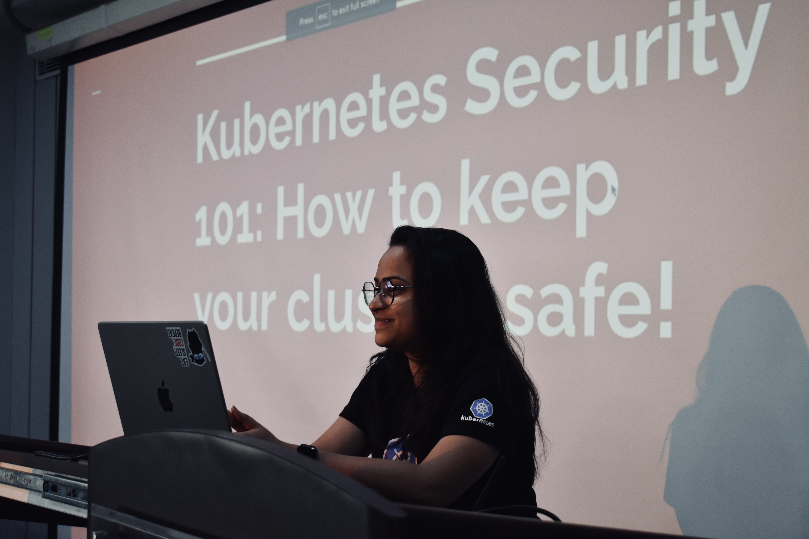

I'm really glad you stopped by my website! Here are a few of the roles I'm currently taking on, along with some projects I'm especially proud of. Lately, I've been diving into MLOps and pipeline management for machine learning—an area I believe can really help organizations by ensuring they deliver effective ML solutions without causing chaos. I also work with cloud infrastructure and DevOps, and I'm a big fan of the serverless approach.

I’m best reached via [email](mailto:subhasmitaofc@gmail.com). I’m always open to interesting conversations and collaboration.

To know about my projects, refer to my [Github profile](https://github.com/SubhasmitaSw). 😊

## Work Experiences

Not a great believer in repeating stuff. If you want to know more about my previous works, you can head over to [LinkedIn](https://linkedin.com/in/subhasmita-swain).

<!-- ## Co-authored Publications 🔖


<ul>
<li><a href="https://doi.org/10.1007/s11831-022-09733-8">Appositeness of Optimized and Reliable Machine Learning for Healthcare: A Survey. Arch Computat Methods Eng 29, 3981–4003 (2022)</a></li>

<li><a href="https://sjcjycl.cn/article/view-2023/pdf/02_3054.pdf">An Introspection on the Upcoming Internet Iteration, the Metaverse: A Survey, Journal of Data Acquisition and Processing 38 (2): 3054-3090 (2023)</li>
</a>

<li>Bhushan B.,Swain S., et al. Cervical Spine Fracture Detection using 2.5D BLSTM and EfficientNet V2 Classification (To be published).</li>
</ul>
 -->

## Leadership & Community 🌟

- Kubernetes v1.30, v1.26 [Release Team](https://github.com/kubernetes/sig-release/tree/master/release-team), part of a select small team that releases a new version of Kubernetes. Additionally, play a significant role in Kubernetes activities, focusing on CI Signal Health Monitoring and Bug Triage.

- [Cluster API](https://github.com/kubernetes-sigs/cluster-api) 1.7 Release Lead Shadow, member of the select team that publishes each new Cluster API version. In the capacity of a shadow, I write release documentation and keep an eye on the stability of the CI pipeline.
- [Linux Foundation Scholarship](https://training.linuxfoundation.org/about/scholarships/) Recipient, sponsored to attend Kubecon + CloudNativeCon 2022.
- Open Source Community Lead at Developer Student Clubs Sharda University, Conducted online
and offline technical and soft-skills training impacting over 500 students.
- [ICAAAIML](https://www.sharda.ac.in/connect/news-details/icaaaiml-2022-international-conference-on-advances-and-applications-of-artificial-intelligence-machine-learning/) Coordinator, Coordinated the ICAAAIML (International Conference on Advances and Appli- cation in Artificial Intelligence and Machine Learning) events, fostering academic collaboration and knowledge exchange among leading experts in the field, while contributing to the university’s academic community.
- Biju Sashaktikaran Yojna Scholarship Recipient, Prestigious scholarship provided for exceptional performance in the higher-secondary (HS) examination.
